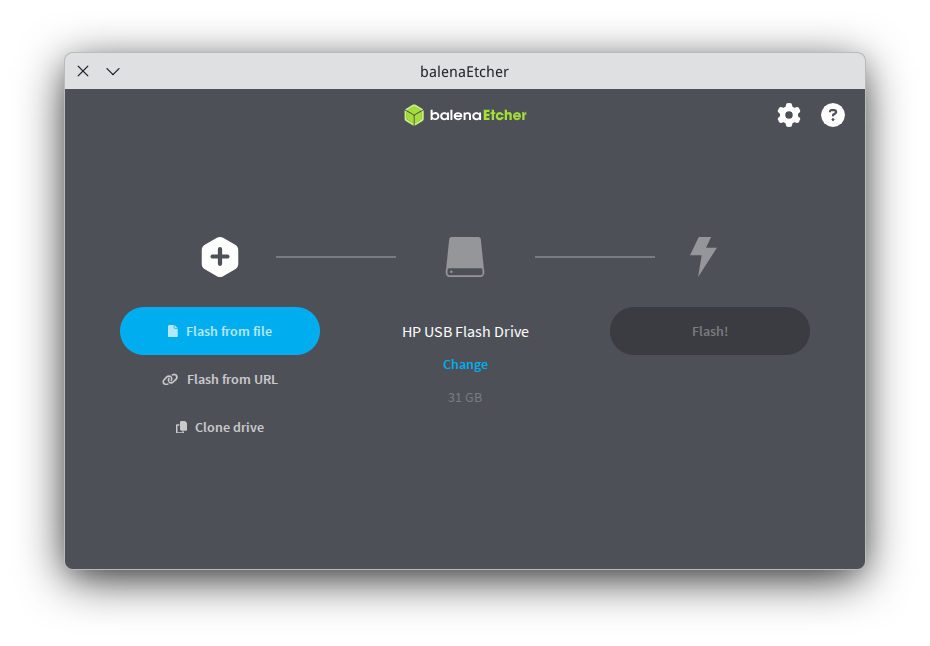
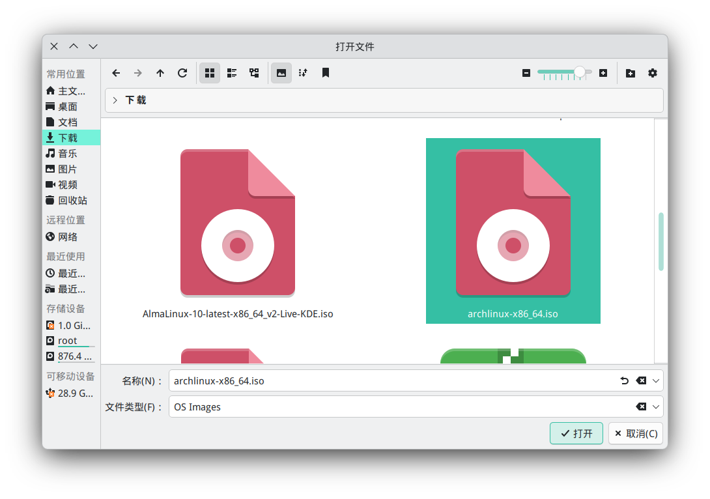
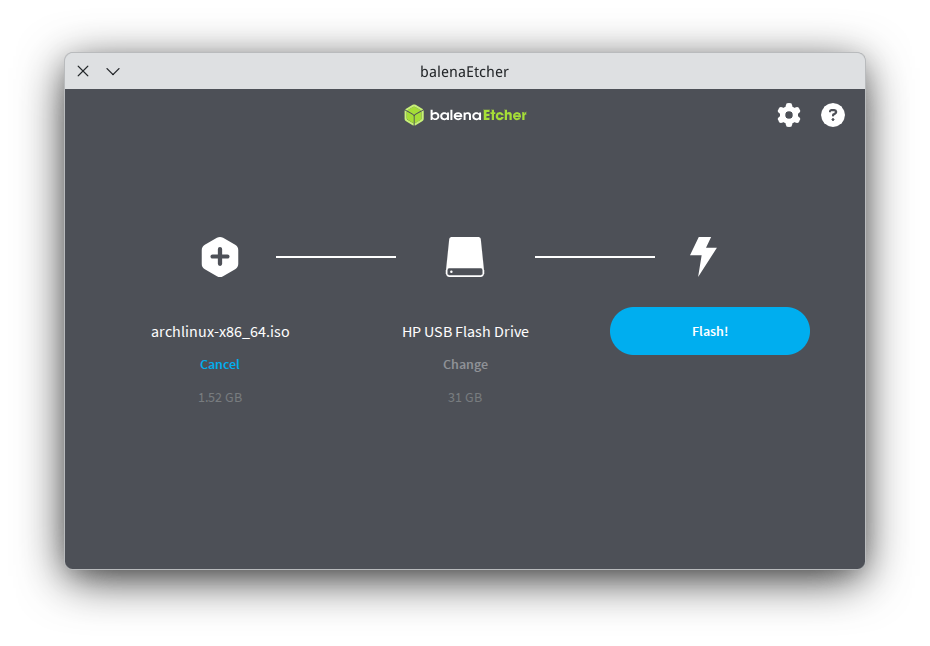
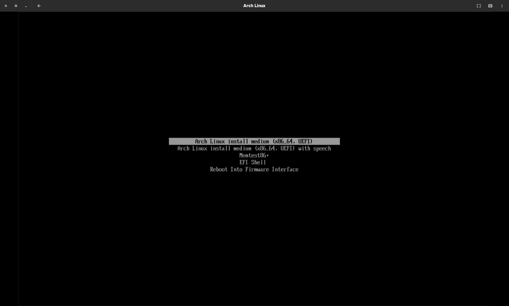

# 准备工作

难度：3.6

## 备份重要数据

*Arch有各种各样的安装方法，但我们用的是“傻瓜式”安装————即全盘安装。————作者*

全盘安装固然是傻瓜式的安装方法，但是，重要的数据————却遭殃了！

我们亟须更妥善地处理这些数据。所以，你备份好了吗？

## 安装Arch基本镜像

从镜像源中安装Arch Linux安装镜像，下列镜像源如下：

* [南京大学（NJU）](https://mirrors.nju.edu.cn/archlinux/iso/latest/archlinux-x86_64.iso)

* [中国科学技术大学](https://mirrors.ustc.edu.cn/archlinux/iso/latest/archlinux-x86_64.iso)

## 刷写ISO镜像

[下载balena](https://mirrors.nju.edu.cn/github-release/balena-io/etcher/LatestRelease/)：

    实用参考
    
    *.deb：Debian系发行版专用版本

    *.rpm：EL专用版本

    *.exe：Windows专用版本

    *.dmg：macOS专用版本

使用balena：

当下载并安装好balena后，选择“从文件中写入”（Flash from file），然后选择下载目录下的"archlinux-x86_64.iso"

选择你插入的U盘（必须备份，刷写时会被擦除！），然后点击”刷写“（Flash）

刷写成功后退出balena。

**在重启前，千万不要忘了备份！**

## 引导ISO

在引导ISO启动前，记得把安全启动（Secure Boot）关闭，以保证LiveISO的正常启动。

*注：本篇只适合带有UEFI的电脑*

### 启动引导ISO

在启动菜单中选择第一个启动项

准备好了吗？
