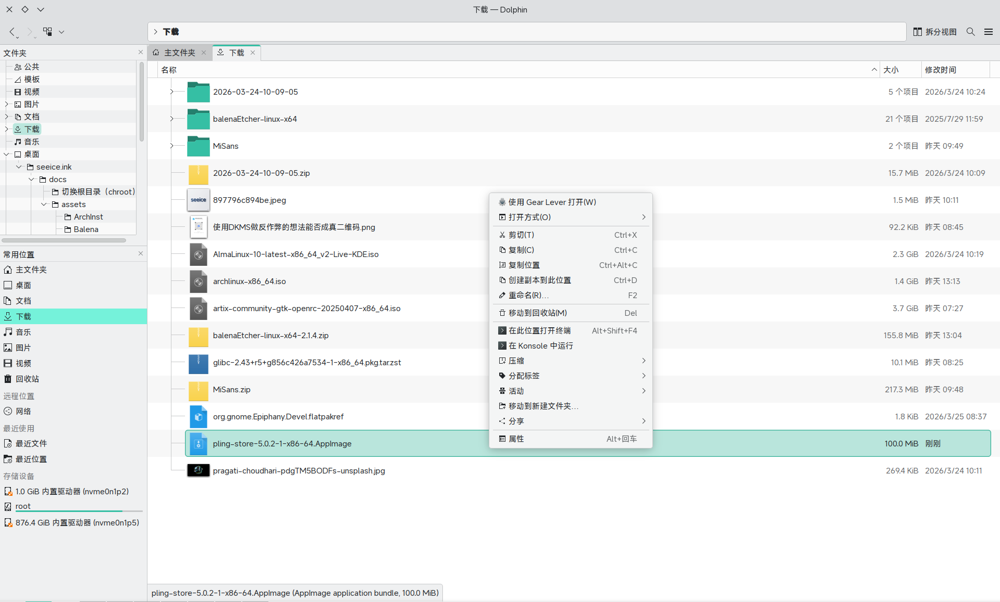
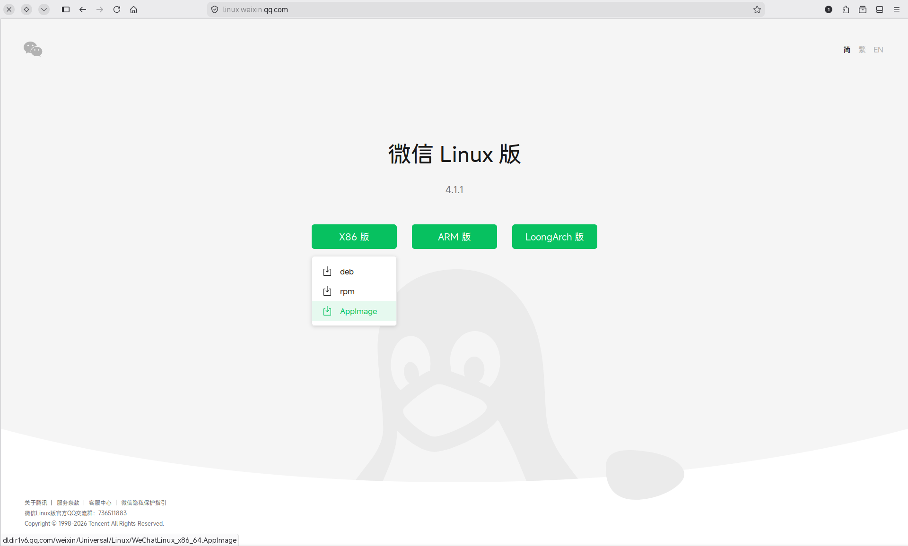
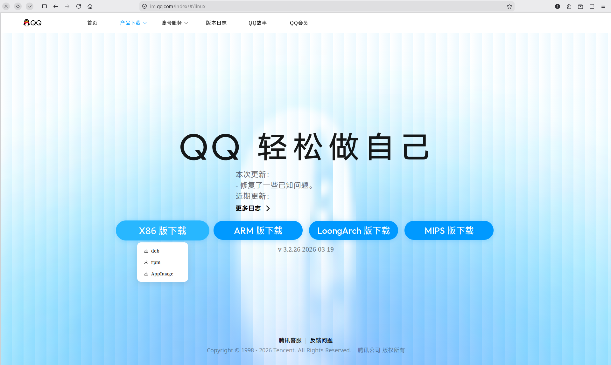

# 基本软件

根据国内环境裁定的基本软件。

## Gear Lever

安装`gearlever`：

    sudo pacman -S gearlever

### 用法

将appimage文件使用`gearlever`打开：

点击“移动到应用菜单”：

在应用菜单上打开它。

## 微信

*目前只裁定原生版本*

### Appimage

从[微信Linux官网](https://linux.weixin.qq.com)安装它(X86,Appimage)：

安装过程参照[Gear Lever](./10.基本软件.md#gear-lever)

### AUR版

使用此命令安装：

    paru -S wechat

## QQ

*目前只裁定原生版本*

### Appimage

从[QQ for Linux](https://im.qq.com/index/#/linux)安装它(X86,Appimage)：

安装过程参照[Gear Lever](./10.基本软件.md#gear-lever)

### AUR版

使用此命令安装：

    paru -S linuxqq

