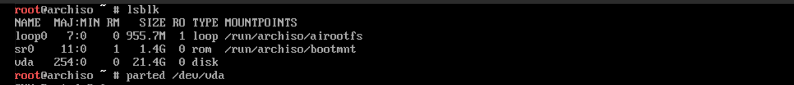

# 分区

难度：5.5

在上文的`tty`中输入`lsblk`或`fdisk -l`检查分区状态

**谨慎点，这是最后一次机会了！**

使用`parted`相关命令分区：

    parted /dev/vda # 注：这里是虚拟磁盘vda，不是sda或nvme0n1相关类型，一定要看仔细了！
    (parted) _

建立分区表

    mklabel gpt

新建分区

    mkpart boot fat32 1% 512M # boot分区
    mkpart primary ext4 513M 100% # 主分区

做完上述操作后，使用`lsblk`或`fdisk -l`确认。