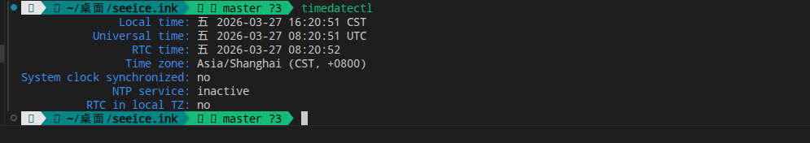

# 基本系统安装

*你要开始玩转Arch的精髓吗？*

难度：8.0

## 更换pacman镜像源

在`/etc/pacman.d/mirrorlist`中写入下述内容（建议多选或全选，以提高成功率）：

    echo "https://mirrors.ustc.edu.cn/archlinux/$repo/os/$arch" > /etc/pacman.d/mirrorlist # USTC源
    echo "https://mirrors.aliyun.com/archlinux/$repo/os/$arch" > /etc/pacman.d/mirrorlist # 阿里源
    echo "https://mirrors.nju.edu.cn/archlinux/$repo/os/$arch" > /etc/pacman.d/mirrorlist # 南京大学源

禁用`reflector`：

    systemctl stop reflector

## Pacstrap安装系统

使用`pacstrap`安装基本系统：

    pacstrap -K /mnt base base-devel linux linux-headers linux-firmware sof-firmware

安装基本工具

    pacstrap -K /mnt git wget curl vim networkmanager sudo bash-completion

## 后续操作

建立`fstab`：

    genfstab -U /mnt >> /mnt/etc/fstab

检查`/etc/fstab`：

    cat /etc/fstab

若文件结构能与下面的文件对上，说明`fstab`没有问题：

    # /etc/fstab: static file system information.
    #
    # Use 'blkid' to print the universally unique identifier for a device; this may
    # be used with UUID= as a more robust way to name devices that works even if
    # disks are added and removed. See fstab(5).
    #
    # <file system> <mount point>  <type>  <options>  <dump>  <pass>
    UUID=A4D9-83D4*                            /boot/efi      vfat    defaults,umask=0077 0 2
    UUID=b63578d9* /              btrfs   subvol=/@,defaults,compress=zstd:1 0 0
    UUID=b63578d9* /home          btrfs   subvol=/@home,defaults,compress=zstd:1 0 0
    UUID=b63578d9* /var/cache     btrfs   subvol=/@cache,defaults,compress=zstd:1 0 0
    UUID=b63578d9* /var/log       btrfs   subvol=/@log,defaults,compress=zstd:1 0 0
    tmpfs                                     /tmp           tmpfs   defaults,noatime,mode=1777 0 0
    # 这里的"*"是省略的UUID,方便你们详细核对文件结构

## 杂项

使用`timedatectl`检查时间，并与实际时间比对，确认无误：

