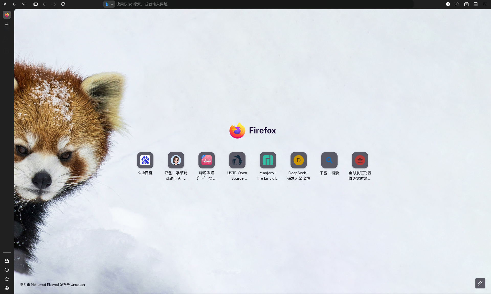

# 补充软件和补充仓库

## 补充软件

Firefox：

安装`firefox`包：

    sudo pacman -S firefox

Firefox是一个自由的浏览器，它是少数拥有独立内核的浏览器之一。

nvidia-open:

安装‘nvidia-open’包：

    sudo pacman -S nvidia-open

这是nvidia的官方显卡驱动。

timeshift和btrfs-assistant(btrfs必备软件)：

安装Timeshift和btrfs-assistant:

    sudo pacman -S timeshift btrfs-assistant

timeshift是快照帮手，而btrfs-assistant是btrfs特化工具。

## 补充仓库

archlinuxcn:

编辑/etc/pacman.conf,加入下列配置

    [archlinuxcn]
    Server=https://mirrors.ustc.edu.cn/archlinuxcn/$arch

安装密钥环：

    sudo pacman -Sy archlinuxcn-keyring

